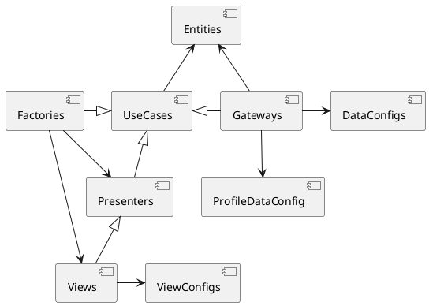

# Architecture

```plantuml
@startuml
[Entities]<--[Gateways]
[Entities]<--[UseCases]
[Factories]-|>[UseCases]
[Factories]-->[Presenters]
[Factories]-->[Views]
[UseCases]<|-[Gateways]
[Gateways]->[DataConfigs]
[Gateways]-->[ProfileDataConfig]
[UseCases]<|--[Presenters]
[Presenters]<|--[Views]
[Views]->[ViewConfigs]
@enduml
```
